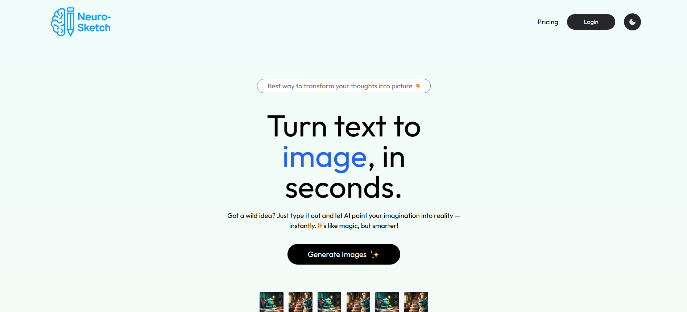
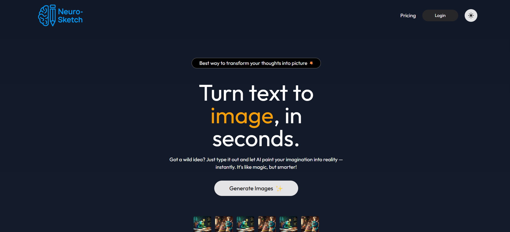
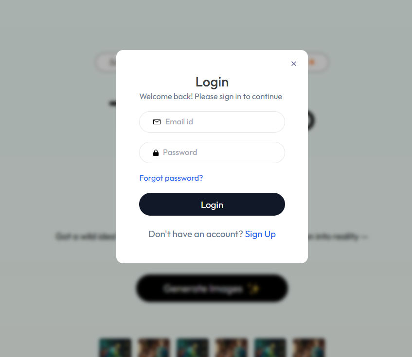
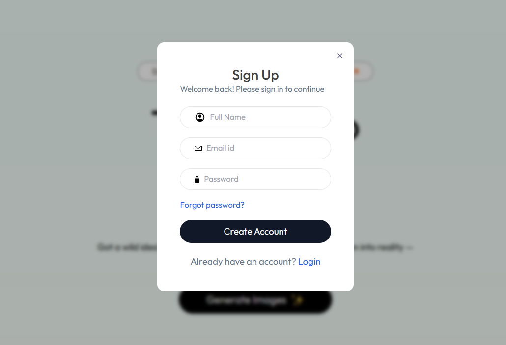
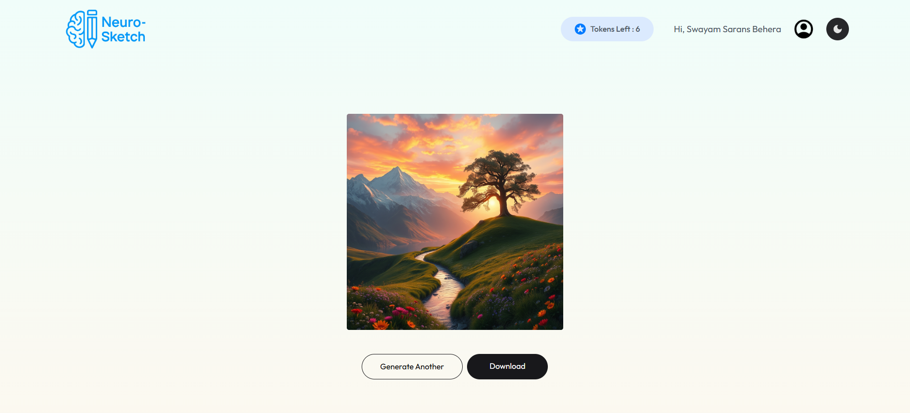
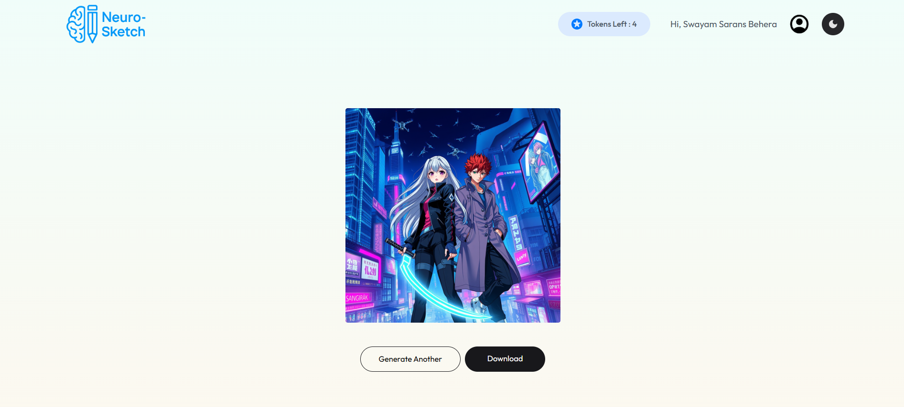
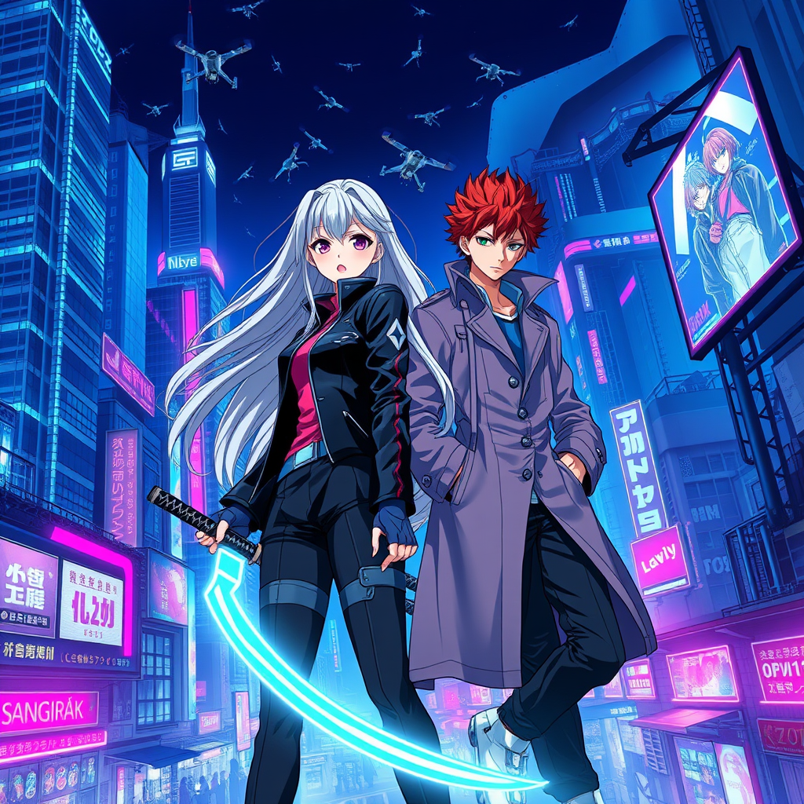
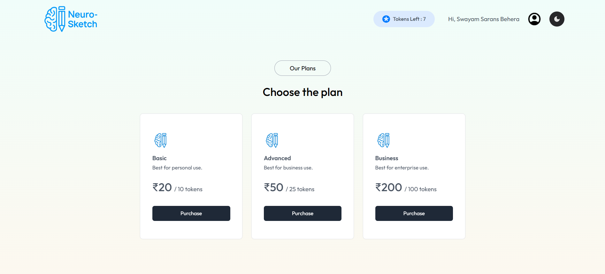
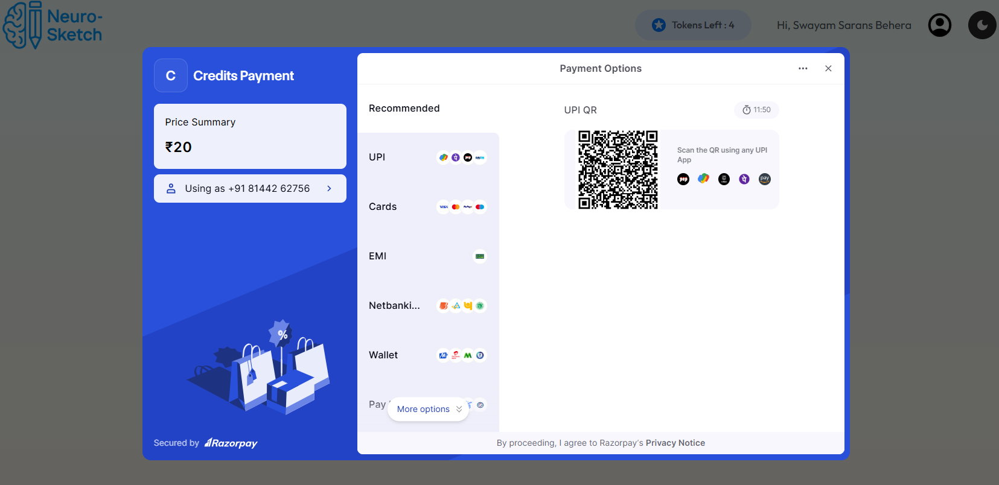
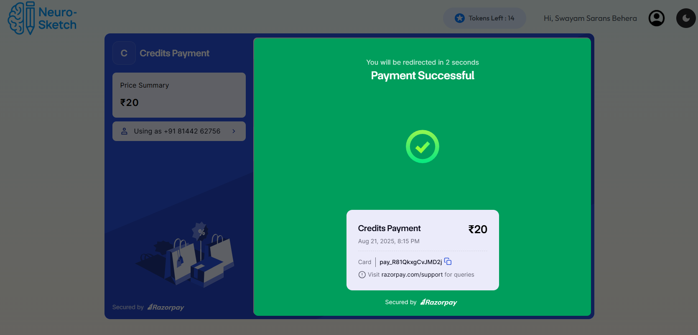

# Neuro-Sketch

Neuro-Sketch is a Text-to-Image converter with Sign In/Sign Up authentication, light/dark theme support, and integrated payment system. Built for creativity and accessibility, it enables users to generate stunning visuals seamlessly.

## 📸 Screenshots

### 🏠 Home Page

|                     Light Mode                      |                     Dark Mode                     |
| :-------------------------------------------------: | :-----------------------------------------------: |
|  |  |

---

### 🔑 Authentication

|               Sign In               |               Sign Up               |
| :---------------------------------: | :---------------------------------: |
|  |  |

---

### 🎨 Image Generation

|                 Input                 |                   Output                    |
| :-----------------------------------: | :-----------------------------------------: |
|  |  |
|  |  |

---

### 💳 Payments

|                    Buy Credits                    |                        Gateway                        |                           Success                           |
| :-----------------------------------------------: | :---------------------------------------------------: | :---------------------------------------------------------: |
|  |  |  |
